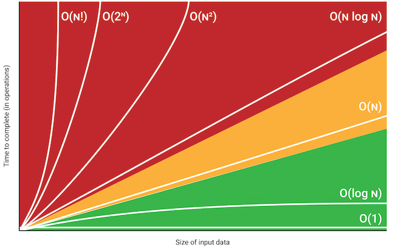
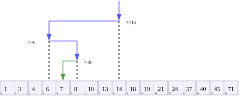
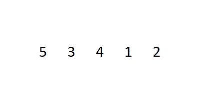
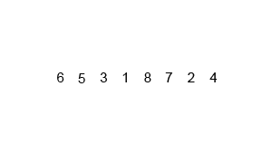
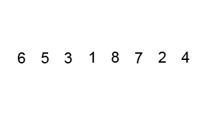

# Big O Notation

To jak klasyfikujemy kod zależy od ilości operacji, które muszą zostać wykonane przez kompter w celu otrzymania wyniku

Jak zmienia się czas potrzebny do wykonania operacji w zależności od ilości danych?



**O(1)**

```jsx
function AddUpTo(n){
	return n * (n+1) / 2;
}
```

**O(n)**

```jsx
 function addUpTo(n){
   let total = 0
   for(let i = 1; i <= n; i++){
     total +=1
   }
   return total
 }
```

**O(n^2)**


## Big O na skróty

1. Operacje arytmetyczne są constantami
2. Przypisanie zmiennej to constant
3. Dostęp do elementów array (za pomocą indeksu) albo obiektu (za pomocą klucza) jest constant
4. Złożoność pętli zależy od długości pętli razy złożoność tego co dzieje się w środku pętli

### Złożoność przestrzeni (Space complexity)

Złożoność przestrzenna algorytmu to całkowita przestrzeń zajmowana przez algorytm w odniesieniu do rozmiaru danych wejściowych. 

## Arrays and Objects

### Objects

- Insertion, Removal, Access - O(1)
- Searching - O(n)

### Arrays

- Insertion, Removal - zalezy gdzie dodajemy, odejmujemy element. Jesli dodajemy nowy element do array za pomoca push, to taka operacja bedzie constant O(1). Jesli chcemy dodac nowy element na poczatku array, to array musi pozmieniac wszystkie indexy itd, ma wiecej operacji do wykonania O(n).
- Searching - O(n)
- Access - O(1)

Metody:

- push, pop - O(1)
- shift, unshift, concat, slice, splice - O(n)
- sort - O(n*logn)
- forEach, map, filter,

# Algorithms and Problem Solving Patterns

## Zrozum problem

Zanim zaczniesz pisać kod, weź krok wstecz i postaraj się zrozumieć zadanie, które masz wykonać. Dokładne zbadanie problemu, pytania bardzo ułatwia wyjaśnienie rzeczy.

- Czy potrafię sparafrazować problem w swoich własnych słowach?
- Jakie inputy wchodzą do problemu
- Jakie outputy powinny wyjśc z problemu?
- Czy mam wystarczająco dużo informacji żeby rozwiązac problem?
- Jak powinienem nazwać ważne elementy danych, które są częścią problemu?

## Poznaj konkretne przykłady

Wymyślanie konkretnych przykładów pozwala ci na lepsze zrozumienie problemu.

- Zacznij z prostymi przykładami
- Pomyśl o bardziej złożonych przykładach
- Pomyśl o przykładach z pustymi inputami i invalid inputami

## Rozbij na mniejsze części

Rozbij na mniejsze kroki, dobre tutaj są komentarze z krokami, które trzeba podjąć. Rozpisz najbardziej podstawowe kroki zanim zaczniesz pisac kod, to zmusza cię do myslenia nad kodem zanim zaczniesz go pisać.


## Rozwiąż/Uprość

1. Jeśli nie potrafisz rozwiązac problemu, spróbuj tymczasowo zignorować część problemu, która sprawia ci trudność.
2. Stwórz uproszczone rozwiązanie problemu i włącz do tego rozwiązania część, która ci sprawiała trudność

## Look back and refactor

Napisanie działającego kodu to nie koniec.

Spójrz na indywidualne komponenty linijka po linijce i omów te części kodu, które ci się nie podobają. Kod potrzebuje balansu między wydajnością i czytelność 

# Problem solving patterns

## Frequency counters

przykład kodu O(n), zastosowanie trzech oddzielnych pętli jest tutaj ok i jest to lepsze rozwiązanie od stosowania nested pętli, które dałyby O(n^2)

```jsx
function validAnagram(a,b){
  if(a.length !== b.length){
    return false
  }
  let counter1 = {}
  let counter2 = {}
  for(let word of a){
    counter1[word] = (counter1[word] ? counter1[word]+=1: counter1[word] = 1)
  }
  for(let word of b){
    counter2[word] = (counter2[word] ? counter2[word]+=1: counter2[word] = 1)
  }
 for(let key in counter1){
   if(!(key in counter2)){
     return false
   }
 }
  return true
}

console.log(validAnagram("anagram", "nagaram"))
```

## Multiple pointers

Tworzenie wskaźników, które odpowiadają indeksowi lub pozycji i przesuwają się w kierunku początku, końca lub środka na podstawie określonego warunku

```jsx
 function sumZero(arr){
   let left = 0
   let right = arr.length - 1
   while(left<right){
     let sum = arr[left] + arr[right]
     if(sum===0){
       return [arr[left], arr[right]]
     }else if(sum > 0){
       right--
     }else{
       left++
     }
   }
 }

sumZero([-4,-3,-2,-1,0,1,2,3,10]) // [-3,3]
```

```jsx
function countUniqueValues(arr){
  if(arr.length === 0) return 0
  let i = 0
  for(let j = 1; j < arr.length; j++){
    if(arr[i] !== arr[j]){
      i++
      arr[i] = arr[j]
    }
  }
  return i+1
}

countUniqueValues([1,1,1,2,3,3,4,5,6])
```

## Sliding window

Przydaje się kiedy działamy na array i szukamy jakiegos podzbioru tego array, który jest w jakiś sposób ciągły

```jsx
function maxSubarraySum(arr, number){
  let maxSum = 0
  let tempSum = 0
  if(arr.length < number) return null
  for(let i = 0; i < number; i++){
    tempSum += arr[i]
  }
  maxSum = tempSum
  for(let i = number; i < arr.length; i++){
    tempSum = tempSum - arr[i-number] + arr[i]
    maxSum = Math.max(tempSum, maxSum) 
  }
  console.log(maxSum)
}

maxSubarraySum([2,6,9,2,1,8,5,6,3], 3)
```

## Divide and Conquer

Rozdzielanie danych na mniejsze kawałki i powtarzanie procesu z podzbiorem, subsetem tych danych

# Recursion

- A process that calls itself.

Recursive funkcje dodają ciągle nowe funkcje do call stack

**Base Case** - moment w którym recursive funkcja kończy się

**Różny input** - za każdym razem kiedy wywołujemy funkcje chcemy zeby miala inny input niz wczesniej 

```jsx
function sumRange(num){
  if(num === 1) return 1;
  return num + sumRange(num-1)
}

sumRange(3) // => 6
```

```jsx
=> sumRange(3)
		return 3 + sumRange(2)
								return 2 + sumRange(1)
														return 1
```

dla `num = 3` funkcja zwraca `3 + sumRange(2)`
funkcja jest powtarzana az do spotkania z Base Case
`3 + sumRange(2)` czeka na `sumRange(2)`, ktore czeka na `2 + sumRange(1)`

```jsx
function silnia(num){
  if(num === 1) return 1
  return num * silnia(num-1)
}

silnia(5) // => 120
```

## Helper Method Recursion

```jsx
function outer(input){
  let outerScopedVariable = []
  
  function helper(helperInput){
    // modify the outerScopeVariable
    helper(helperInput--)
  }
  
  helper(input)
  
  return outerScoperVariable
}
```

```jsx
function collectOddValues(arr){
  
  let result = []
  
  function helper(helperInput){
    if(helperInput.length === 0){
      return
    }
    if(helperInput[0] % 2 !== 0){
      result.push(helperInput[0])
    }
    helper(helperInput.slice(1))
  }
  
  helper(arr)
  return result
  
}
```

## Pure Recursion

```jsx
function collectOddValues(arr){
  let newArr = [];
  
  if(arr.length == 0){
    return newArr
  }
  
  if(arr[0] % 2 !== 0){
    newArr.push(arr[0])
  }
  
  newArr = newArr.concat(collectOddValues(arr.slice(1)))
  return newArr
  
}

collectOddValues([1,2,3,4,5]) // => [1,3,5]
```

```jsx
collectOddValues([1,2,3,4,5]) //  => [1,3,5]
[1].concat(collectOddValues([2,3,4,5]))
					[].concat(collectOddValues[3,4,5])
										[3].concat(collectOddValues[4,5])
																[].concat(collectOddValues[5])
																					[5].concat(collectOddValues[])
																										 []
```

# Searching algorithms

## Linear search

`indexOf` , `includes` , `find`  i `findIndex`  - wszystkie te metody to linear search. 
Po kolei sprawdzają każdy item dopóki nie znajdą pasującego elementu. Linear search jest O(n) chyba, ze element jest na poczatku arraya wtedy znajdujemy szybko. Im dluzszy array tym dluzszy średni czas szukania elementu.

## Binary search



Binary search jest duzo szybszy, zamiast eliminowania jednego elementu na raz (linear search sprawdza jeden, eliminuje i idzie do nastepnego) mozna wyeliminowac polowe elementow na raz. Binary search dziala tylko na posortowanych arrayach! Sredni czas to O(logn)

Szukamy połowe posortowanego arraya i sprawdzamy czy wybrany środek jest przed czy po elemencie, którego szukamy. Z połowy wybieramy następną połowe itd.

```jsx
const sortedNumbers = [2, 5, 8, 11, 15, 23, 37, 42, 56, 68];

function binarySearch(array, value){
	// tworzymy trzy wskazniki
  let left = 0
  let right = array.length-1
  let middle = Math.round((left+right)/2)

  while(array[middle] !== value && left <= right){
	  // left musi byc mniejszy/rowny right bo inaczej funkcja bedzie trwala w nieskonczonosc
    // przesuwamy wskazniki w zaleznosci od tego czy middle jest mniejszy czy wiekszy
    if(array[middle] > value) right = middle-1
    else left = middle+1
    middle = Math.round((left+right)/2)
  }
  
  if(array[middle] === value) return middle
  else return -1
}

console.log(binarySearch(sortedNumbers,37))
```

# Sorting algorithms

Sortowanie jest bardzo często używane w programowaniu, dobrze jest zrozumieć jak działa algorytm sortowania a każdy algorytm ma swoje wady i zalety

Javascript ma metodę `array.sort()` , domyślna kolejność sortowania wg. unicode. Przy domyślnych ustawieniach metoda jest przydatna tylko przy stringach, na numerach nie dziala. Można stworzyć funkcje porównującą, która bierze dwie wartości `a` i `b` , jeśli funkcja zwraca wynik ujemny to a jest przed b, dla wyniku dodatniego b jest przed a, dla zera są w tym samym miejscu

## Bubble sort


Bubble sort porównuje dwie wartości, jeśli jedna jest większa od drugiej to swapujemy, zamieniamy je miejscami. Funkcja kilka razy będzie przemielała funkcję w taki sposób, że największe wartości bąbelkują na górę (na koniec).

Ten algorytm nie jest często używany, ale jest dobrym problemem.

```jsx
function bubbleSort(array){
  let noSwaps // ta zmienna bedzie sprawdzac czy podczas loopa zrobilismy swapa
  for(let i = array.length; i > 0; i--){
    console.log(array)
    let noSwaps = true // domyslnie jest true, jesli zrobimy swapa bedzie false
    // idziemy od tylu zeby zmniejszac liczbe odpalania sie petli za 
    // kazdym razem kiedy znaleziona liczba wybąbelkuje na góre.
    // Dlatego j < i-1
    for(let j = 0; j<i-1; j++){
      if(array[j] > array[j+1]){
        swap(array, j,j+1)
        noSwaps = false
      }
    }
    // jesli nie zrobilismy swapa to znaczy, ze array jest juz posortowany
    // nie ma sensu ciągle go mielić aż do końca pętli bo nie wprowadzamy
    // już żadnych zmian, dlatego przerywamy pętle i zwracamy wynik
    if(noSwaps)break 
  }
  return array
}
```

Funkcja swap

```jsx
function swap(array, index1, index2){
  let temp = array[index1]
  array[index1] = array[index2]
  array[index2] = temp
  // es2015
  // [array[index1], array[index2]] = [array[index2], array[index1]]
}
```

## Selection sort



Podobny do bubble sort tylko zamiast ukladac najpierw najwyższe wartości to wstawia najmniejsze na początek. 

Selection sort jest `O(n^2)`

```jsx
function selectionSort(array){
  for(let i = 0; i < array.length; i++){

    let minIndex = i
    for(let j = i+1; j < array.length; j++){
      if(array[j] < array[minIndex]) minIndex = j
    }

    if(i !== minIndex) swap(array, i, minIndex)
  }
  return array
}
```

## Insertion sort


Insertion sort stopniowo tworzy większą lewą porcję array, która jest zawsze posortowana. Algorytm zapamiętuję sub array i wstawia następne wartości między te już posortowane. Insertion sort jest przydatny kiedy mamy do czynienia z wpływającymi danymi i od razu chcemy je sortować.

Insertion sort jest `O(n^2)`

```jsx
function insertionSort(array){
  for(let i = 1; i < array.length; i++){
    let currentValue = array[i]
    let j
    
    // inner loop zaczyna sie na indeksie o 1 mniejszym od i 
    // leci w dół porównując wartości   
    // && array[h] > currentValue zapobiega tutaj niepotrzebnemu loopowaniu
    // i porównywaniu wartości, które i tak są mniejsze po co więc je porównywać
    // ten conditional jest tez bramką bo zawsze sprawdza czy wartośc jest większa od currentValue
    for(j = i-1; j >= 0 && array[j] > currentValue; j--){
      array[j+1] = array[j] // jesli array[j] jest wieksze od array[j+1] to zmieniamy 
    }
    array[j+1] = currentValue // tutaj podmieniamy

  }

  return array
}
```

## Merge sort

Merge sort i następne algorytmy są lepsze od poprzednich.



Merge sort rozdziela array na mniejsze arraye z pojedynczymi elementami. Algorytm porównuje pojedyncze elementy i sprawdza, który jest większy i tworzy arraye z dwoma elementami, następnie porównuje posortowane już arraye i tworzy następne itd. Wynikiem jest nowy posortowany array

Merge sort jest `O(nlogn)`

funkcja merge:

```jsx
function merge(arr1, arr2) {
  let result = [];
  let i = 0;
  let j = 0;
  while (i < arr1.length && j < arr2.length) {
    if (arr1[i] < arr2[j]) {
      result.push(arr1[i]);
      i++;
    } else {
      result.push(arr2[j]);
      j++;
    }
  }

  // jeżeli arr1 i arr2 nie mają takiej samej liczby elementów to po
  // zakończeniu porównywania trzeba te elementy dodać do wyniku
  // dwa while loopy poniżej dbają o to żeby pozostale
  // wartości w arrayach zostały dodane do wyniku
  while (i < arr1.length) {
    result.push(arr1[i]);
    i++;
  }

  while (j < arr2.length) {
    result.push(arr2[j]);
    j++;
  }

  return result;
}

console.log(merge([1, 10, 50], [2, 14, 99, 100]));
```

mergeSort:

```jsx
function mergeSort(arr) {
  if (arr.length <= 1) return arr; // base case
  let middle = Math.floor(arr.length / 2);
  // niech mergeSort([61,30,21,14])
  // 1. array przechodzi checka i idzie dalej
  // 2. array jest podzielony na [61,30] i [21,14]
  // 3. [61,30] wchodzi do recursive funkcji i jest rozdzielany na [61] i [30]
  // w zależności od wielkości array callstack będzie się powiększać i 
  // poprzednia wartość będzie czekała na następną
  // [61] wchodzi do recursive funkcji i zwraca [61]
  // [30] wchodzi do recursive funkcji i zwraca [30]
  // uruchamiamy merge i dostajemy [30, 61] - to jest wartość leftHalf
  // 4. [21,14] wchodzi do recursive funkcji i jest rozdzielany tak jak wyżej
  // (...)
  // wartość rightHalf to [14,21]
  // 5. odpalamy merge i dostajemy wynik [14,21,30,61]
  let leftHalf = mergeSort(arr.slice(0, middle)); // recursive case
  let rightHalf = mergeSort(arr.slice(middle)); // recursive case
  return merge(leftHalf, rightHalf)

}

console.log(mergeSort([61, 30, 21, 14,]));
```

## Quick sort



obieramy jakiś pivot point, sprawdzamy ile jest mniejszych wartości od pivot wartości w array i wstawiamy je przed ten pivot point (nie muszą być w tym momencie posortowane), szukając tych wartości zapisujemy ile ich znaleziono, pivot point przeskakuje do przodu o tą wartość. Operujemy ciągle na jednym arrayu i czynności te są powtarzane rekursywnie.

Time complexity to `O(nlogn)`

pivot funkcja

```jsx
function pivot(array, startIndex = 0, endIndex = array.length - 1) {
  let pivot = array[startIndex];
  let currentPivotIndex = startIndex;
  for (let i = startIndex + 1; i <= endIndex; i++) {
    if (array[i] < pivot) {
      currentPivotIndex++;
      swap(array, currentPivotIndex, i)
    }
  }
  swap(array, startIndex, currentPivotIndex)
  console.log(array);
  return currentPivotIndex;
}

const unsortedNumbers = [4, 8, 2, 1, 5, 7, 6, 3];
console.log(pivot(unsortedNumbers));

```

quick sort

```jsx
function quickSort(arr, left = 0, right = arr.length - 1) {
  // kiedy left i right są takie same oznacza to, że po
  // rekursywnym odpalaniu funkcji quicksort doszliśmy do momentu
  // w którym subarray ma jeden element
  if (left < right) {
    let pivotIndex = pivot(arr, left, right);

    //left
    quickSort(arr, left, pivotIndex - 1);
    //right
    quickSort(arr, pivotIndex + 1);
  }
  return arr;
}
```

## Radix sort

Wszystkie poprzednie sorty należą do algorytmów sortujących porównujących, najlepsze time complexity możliwe przy tych algorytmach to `O(nlogn)`. Radix sort niczego nie porównuje, jest specjalny i działa na liczbach. Wykorzystuje informacje o wielkości cyfr - więcej cyfr to większa liczba.


Radix tworzy 9 bucketów i sprawdza pierwszą cyfre od prawej strony każdego elementu array i grupuje liczby według tej cyfry, tworzy to ten sam array ale inaczej uporządkowany. Potem powtarzamy operacje na nowym arrayu dla następnej cyfry.

Radix sort jest `O(nk)`, gdzie n - długość array, k - średnia liczba cyfr

helper funkcje do radix sort

```jsx
function getDigit(num,place){
  return Math.floor(Math.abs(num)/Math.pow(10,place) % 10)
}

function digitCount(num){
  if(num === 0) return 1
  return Math.floor(Math.log10(Math.abs(num))) + 1
}

function mostDigits(arr){
  let max = arr[0]
  for(number of arr){
    if(number > max) max = number
  }
  return digitCount(max)
}

```

radixSort

```jsx
function radixSort(arr){
 const largestNumberOfDigits = mostDigits(arr)
 for(let k = 0; k <= largestNumberOfDigits; k++){
  let buckets = {0: [], 1:[], 2:[], 3:[], 4:[], 5:[], 6:[], 7:[], 8:[], 9:[]}
  for(number of arr){
    const digit = getDigit(number, k)
    buckets[digit].push(number)
  }
  arr = [].concat(...Object.values(buckets));
 }
 return arr
}
```