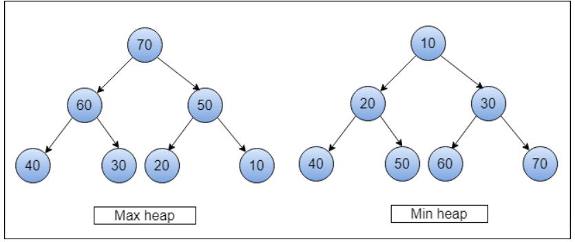

# Big O Notation

To jak klasyfikujemy kod zależy od ilości operacji, które muszą zostać wykonane przez kompter w celu otrzymania wyniku

Jak zmienia się czas potrzebny do wykonania operacji w zależności od ilości danych?


**O(1)**

```jsx
function AddUpTo(n){
	return n * (n+1) / 2;
}
```

**O(n)**

```jsx
 function addUpTo(n){
   let total = 0
   for(let i = 1; i <= n; i++){
     total +=1
   }
   return total
 }
```

**O(n^2)**


## Big O na skróty

1. Operacje arytmetyczne są constantami
2. Przypisanie zmiennej to constant
3. Dostęp do elementów array (za pomocą indeksu) albo obiektu (za pomocą klucza) jest constant
4. Złożoność pętli zależy od długości pętli razy złożoność tego co dzieje się w środku pętli

### Złożoność przestrzeni (Space complexity)

Złożoność przestrzenna algorytmu to całkowita przestrzeń zajmowana przez algorytm w odniesieniu do rozmiaru danych wejściowych. 

## Arrays and Objects

### Objects

- Insertion, Removal, Access - O(1)
- Searching - O(n)

### Arrays

- Insertion, Removal - zalezy gdzie dodajemy, odejmujemy element. Jesli dodajemy nowy element do array za pomoca push, to taka operacja bedzie constant O(1). Jesli chcemy dodac nowy element na poczatku array, to array musi pozmieniac wszystkie indexy itd, ma wiecej operacji do wykonania O(n).
- Searching - O(n)
- Access - O(1)

Metody:

- push, pop - O(1)
- shift, unshift, concat, slice, splice - O(n)
- sort - O(n*logn)
- forEach, map, filter,

# Algorithms and Problem Solving Patterns

## Zrozum problem

Zanim zaczniesz pisać kod, weź krok wstecz i postaraj się zrozumieć zadanie, które masz wykonać. Dokładne zbadanie problemu, pytania bardzo ułatwia wyjaśnienie rzeczy.

- Czy potrafię sparafrazować problem w swoich własnych słowach?
- Jakie inputy wchodzą do problemu
- Jakie outputy powinny wyjśc z problemu?
- Czy mam wystarczająco dużo informacji żeby rozwiązac problem?
- Jak powinienem nazwać ważne elementy danych, które są częścią problemu?

## Poznaj konkretne przykłady

Wymyślanie konkretnych przykładów pozwala ci na lepsze zrozumienie problemu.

- Zacznij z prostymi przykładami
- Pomyśl o bardziej złożonych przykładach
- Pomyśl o przykładach z pustymi inputami i invalid inputami

## Rozbij na mniejsze części

Rozbij na mniejsze kroki, dobre tutaj są komentarze z krokami, które trzeba podjąć. Rozpisz najbardziej podstawowe kroki zanim zaczniesz pisac kod, to zmusza cię do myslenia nad kodem zanim zaczniesz go pisać.


## Rozwiąż/Uprość

1. Jeśli nie potrafisz rozwiązac problemu, spróbuj tymczasowo zignorować część problemu, która sprawia ci trudność.
2. Stwórz uproszczone rozwiązanie problemu i włącz do tego rozwiązania część, która ci sprawiała trudność

## Look back and refactor

Napisanie działającego kodu to nie koniec.

Spójrz na indywidualne komponenty linijka po linijce i omów te części kodu, które ci się nie podobają. Kod potrzebuje balansu między wydajnością i czytelność 

# Problem solving patterns

## Frequency counters

przykład kodu O(n), zastosowanie trzech oddzielnych pętli jest tutaj ok i jest to lepsze rozwiązanie od stosowania nested pętli, które dałyby O(n^2)

```jsx
function validAnagram(a,b){
  if(a.length !== b.length){
    return false
  }
  let counter1 = {}
  let counter2 = {}
  for(let word of a){
    counter1[word] = (counter1[word] ? counter1[word]+=1: counter1[word] = 1)
  }
  for(let word of b){
    counter2[word] = (counter2[word] ? counter2[word]+=1: counter2[word] = 1)
  }
 for(let key in counter1){
   if(!(key in counter2)){
     return false
   }
 }
  return true
}

console.log(validAnagram("anagram", "nagaram"))
```

## Multiple pointers

Tworzenie wskaźników, które odpowiadają indeksowi lub pozycji i przesuwają się w kierunku początku, końca lub środka na podstawie określonego warunku

```jsx
 function sumZero(arr){
   let left = 0
   let right = arr.length - 1
   while(left<right){
     let sum = arr[left] + arr[right]
     if(sum===0){
       return [arr[left], arr[right]]
     }else if(sum > 0){
       right--
     }else{
       left++
     }
   }
 }

sumZero([-4,-3,-2,-1,0,1,2,3,10]) // [-3,3]
```

```jsx
function countUniqueValues(arr){
  if(arr.length === 0) return 0
  let i = 0
  for(let j = 1; j < arr.length; j++){
    if(arr[i] !== arr[j]){
      i++
      arr[i] = arr[j]
    }
  }
  return i+1
}

countUniqueValues([1,1,1,2,3,3,4,5,6])
```

## Sliding window

Przydaje się kiedy działamy na array i szukamy jakiegos podzbioru tego array, który jest w jakiś sposób ciągły

```jsx
function maxSubarraySum(arr, number){
  let maxSum = 0
  let tempSum = 0
  if(arr.length < number) return null
  for(let i = 0; i < number; i++){
    tempSum += arr[i]
  }
  maxSum = tempSum
  for(let i = number; i < arr.length; i++){
    tempSum = tempSum - arr[i-number] + arr[i]
    maxSum = Math.max(tempSum, maxSum) 
  }
  console.log(maxSum)
}

maxSubarraySum([2,6,9,2,1,8,5,6,3], 3)
```

## Divide and Conquer

Rozdzielanie danych na mniejsze kawałki i powtarzanie procesu z podzbiorem, subsetem tych danych

# Recursion

- A process that calls itself.

Recursive funkcje dodają ciągle nowe funkcje do call stack

**Base Case** - moment w którym recursive funkcja kończy się

**Różny input** - za każdym razem kiedy wywołujemy funkcje chcemy zeby miala inny input niz wczesniej 

```jsx
function sumRange(num){
  if(num === 1) return 1;
  return num + sumRange(num-1)
}

sumRange(3) // => 6
```

```jsx
=> sumRange(3)
		return 3 + sumRange(2)
								return 2 + sumRange(1)
														return 1
```

dla `num = 3` funkcja zwraca `3 + sumRange(2)`
funkcja jest powtarzana az do spotkania z Base Case
`3 + sumRange(2)` czeka na `sumRange(2)`, ktore czeka na `2 + sumRange(1)`

```jsx
function silnia(num){
  if(num === 1) return 1
  return num * silnia(num-1)
}

silnia(5) // => 120
```

## Helper Method Recursion

```jsx
function outer(input){
  let outerScopedVariable = []
  
  function helper(helperInput){
    // modify the outerScopeVariable
    helper(helperInput--)
  }
  
  helper(input)
  
  return outerScoperVariable
}
```

```jsx
function collectOddValues(arr){
  
  let result = []
  
  function helper(helperInput){
    if(helperInput.length === 0){
      return
    }
    if(helperInput[0] % 2 !== 0){
      result.push(helperInput[0])
    }
    helper(helperInput.slice(1))
  }
  
  helper(arr)
  return result
  
}
```

## Pure Recursion

```jsx
function collectOddValues(arr){
  let newArr = [];
  
  if(arr.length == 0){
    return newArr
  }
  
  if(arr[0] % 2 !== 0){
    newArr.push(arr[0])
  }
  
  newArr = newArr.concat(collectOddValues(arr.slice(1)))
  return newArr
  
}

collectOddValues([1,2,3,4,5]) // => [1,3,5]
```

```jsx
collectOddValues([1,2,3,4,5]) //  => [1,3,5]
[1].concat(collectOddValues([2,3,4,5]))
					[].concat(collectOddValues[3,4,5])
										[3].concat(collectOddValues[4,5])
																[].concat(collectOddValues[5])
																					[5].concat(collectOddValues[])
																										 []
```

# Searching algorithms

## Linear search

`indexOf` , `includes` , `find`  i `findIndex`  - wszystkie te metody to linear search. 
Po kolei sprawdzają każdy item dopóki nie znajdą pasującego elementu. Linear search jest O(n) chyba, ze element jest na poczatku arraya wtedy znajdujemy szybko. Im dluzszy array tym dluzszy średni czas szukania elementu.

## Binary search


Binary search jest duzo szybszy, zamiast eliminowania jednego elementu na raz (linear search sprawdza jeden, eliminuje i idzie do nastepnego) mozna wyeliminowac polowe elementow na raz. Binary search dziala tylko na posortowanych arrayach! Sredni czas to O(logn)

Szukamy połowe posortowanego arraya i sprawdzamy czy wybrany środek jest przed czy po elemencie, którego szukamy. Z połowy wybieramy następną połowe itd.

```jsx
const sortedNumbers = [2, 5, 8, 11, 15, 23, 37, 42, 56, 68];

function binarySearch(array, value){
	// tworzymy trzy wskazniki
  let left = 0
  let right = array.length-1
  let middle = Math.round((left+right)/2)

  while(array[middle] !== value && left <= right){
	  // left musi byc mniejszy/rowny right bo inaczej funkcja bedzie trwala w nieskonczonosc
    // przesuwamy wskazniki w zaleznosci od tego czy middle jest mniejszy czy wiekszy
    if(array[middle] > value) right = middle-1
    else left = middle+1
    middle = Math.round((left+right)/2)
  }
  
  if(array[middle] === value) return middle
  else return -1
}

console.log(binarySearch(sortedNumbers,37))
```

# Sorting algorithms

Sortowanie jest bardzo często używane w programowaniu, dobrze jest zrozumieć jak działa algorytm sortowania a każdy algorytm ma swoje wady i zalety

Javascript ma metodę `array.sort()` , domyślna kolejność sortowania wg. unicode. Przy domyślnych ustawieniach metoda jest przydatna tylko przy stringach, na numerach nie dziala. Można stworzyć funkcje porównującą, która bierze dwie wartości `a` i `b` , jeśli funkcja zwraca wynik ujemny to a jest przed b, dla wyniku dodatniego b jest przed a, dla zera są w tym samym miejscu

## Bubble sort


Bubble sort porównuje dwie wartości, jeśli jedna jest większa od drugiej to swapujemy, zamieniamy je miejscami. Funkcja kilka razy będzie przemielała funkcję w taki sposób, że największe wartości bąbelkują na górę (na koniec).

Ten algorytm nie jest często używany, ale jest dobrym problemem.

```jsx
function bubbleSort(array){
  let noSwaps // ta zmienna bedzie sprawdzac czy podczas loopa zrobilismy swapa
  for(let i = array.length; i > 0; i--){
    console.log(array)
    let noSwaps = true // domyslnie jest true, jesli zrobimy swapa bedzie false
    // idziemy od tylu zeby zmniejszac liczbe odpalania sie petli za 
    // kazdym razem kiedy znaleziona liczba wybąbelkuje na góre.
    // Dlatego j < i-1
    for(let j = 0; j<i-1; j++){
      if(array[j] > array[j+1]){
        swap(array, j,j+1)
        noSwaps = false
      }
    }
    // jesli nie zrobilismy swapa to znaczy, ze array jest juz posortowany
    // nie ma sensu ciągle go mielić aż do końca pętli bo nie wprowadzamy
    // już żadnych zmian, dlatego przerywamy pętle i zwracamy wynik
    if(noSwaps)break 
  }
  return array
}
```

Funkcja swap

```jsx
function swap(array, index1, index2){
  let temp = array[index1]
  array[index1] = array[index2]
  array[index2] = temp
  // es2015
  // [array[index1], array[index2]] = [array[index2], array[index1]]
}
```

## Selection sort


Podobny do bubble sort tylko zamiast ukladac najpierw najwyższe wartości to wstawia najmniejsze na początek. 

Selection sort jest `O(n^2)`

```jsx
function selectionSort(array){
  for(let i = 0; i < array.length; i++){

    let minIndex = i
    for(let j = i+1; j < array.length; j++){
      if(array[j] < array[minIndex]) minIndex = j
    }

    if(i !== minIndex) swap(array, i, minIndex)
  }
  return array
}
```

## Insertion sort


Insertion sort stopniowo tworzy większą lewą porcję array, która jest zawsze posortowana. Algorytm zapamiętuję sub array i wstawia następne wartości między te już posortowane. Insertion sort jest przydatny kiedy mamy do czynienia z wpływającymi danymi i od razu chcemy je sortować.

Insertion sort jest `O(n^2)`

```jsx
function insertionSort(array){
  for(let i = 1; i < array.length; i++){
    let currentValue = array[i]
    let j
    
    // inner loop zaczyna sie na indeksie o 1 mniejszym od i 
    // leci w dół porównując wartości   
    // && array[h] > currentValue zapobiega tutaj niepotrzebnemu loopowaniu
    // i porównywaniu wartości, które i tak są mniejsze po co więc je porównywać
    // ten conditional jest tez bramką bo zawsze sprawdza czy wartośc jest większa od currentValue
    for(j = i-1; j >= 0 && array[j] > currentValue; j--){
      array[j+1] = array[j] // jesli array[j] jest wieksze od array[j+1] to zmieniamy 
    }
    array[j+1] = currentValue // tutaj podmieniamy

  }

  return array
}
```

## Merge sort

Merge sort i następne algorytmy są lepsze od poprzednich.


Merge sort rozdziela array na mniejsze arraye z pojedynczymi elementami. Algorytm porównuje pojedyncze elementy i sprawdza, który jest większy i tworzy arraye z dwoma elementami, następnie porównuje posortowane już arraye i tworzy następne itd. Wynikiem jest nowy posortowany array

Merge sort jest `O(nlogn)`

funkcja merge:

```jsx
function merge(arr1, arr2) {
  let result = [];
  let i = 0;
  let j = 0;
  while (i < arr1.length && j < arr2.length) {
    if (arr1[i] < arr2[j]) {
      result.push(arr1[i]);
      i++;
    } else {
      result.push(arr2[j]);
      j++;
    }
  }

  // jeżeli arr1 i arr2 nie mają takiej samej liczby elementów to po
  // zakończeniu porównywania trzeba te elementy dodać do wyniku
  // dwa while loopy poniżej dbają o to żeby pozostale
  // wartości w arrayach zostały dodane do wyniku
  while (i < arr1.length) {
    result.push(arr1[i]);
    i++;
  }

  while (j < arr2.length) {
    result.push(arr2[j]);
    j++;
  }

  return result;
}

console.log(merge([1, 10, 50], [2, 14, 99, 100]));
```

mergeSort:

```jsx
function mergeSort(arr) {
  if (arr.length <= 1) return arr; // base case
  let middle = Math.floor(arr.length / 2);
  // niech mergeSort([61,30,21,14])
  // 1. array przechodzi checka i idzie dalej
  // 2. array jest podzielony na [61,30] i [21,14]
  // 3. [61,30] wchodzi do recursive funkcji i jest rozdzielany na [61] i [30]
  // w zależności od wielkości array callstack będzie się powiększać i 
  // poprzednia wartość będzie czekała na następną
  // [61] wchodzi do recursive funkcji i zwraca [61]
  // [30] wchodzi do recursive funkcji i zwraca [30]
  // uruchamiamy merge i dostajemy [30, 61] - to jest wartość leftHalf
  // 4. [21,14] wchodzi do recursive funkcji i jest rozdzielany tak jak wyżej
  // (...)
  // wartość rightHalf to [14,21]
  // 5. odpalamy merge i dostajemy wynik [14,21,30,61]
  let leftHalf = mergeSort(arr.slice(0, middle)); // recursive case
  let rightHalf = mergeSort(arr.slice(middle)); // recursive case
  return merge(leftHalf, rightHalf)

}

console.log(mergeSort([61, 30, 21, 14,]));
```

## Quick sort


obieramy jakiś pivot point, sprawdzamy ile jest mniejszych wartości od pivot wartości w array i wstawiamy je przed ten pivot point (nie muszą być w tym momencie posortowane), szukając tych wartości zapisujemy ile ich znaleziono, pivot point przeskakuje do przodu o tą wartość. Operujemy ciągle na jednym arrayu i czynności te są powtarzane rekursywnie.

Time complexity to `O(nlogn)`

pivot funkcja

```jsx
function pivot(array, startIndex = 0, endIndex = array.length - 1) {
  let pivot = array[startIndex];
  let currentPivotIndex = startIndex;
  for (let i = startIndex + 1; i <= endIndex; i++) {
    if (array[i] < pivot) {
      currentPivotIndex++;
      swap(array, currentPivotIndex, i)
    }
  }
  swap(array, startIndex, currentPivotIndex)
  console.log(array);
  return currentPivotIndex;
}

const unsortedNumbers = [4, 8, 2, 1, 5, 7, 6, 3];
console.log(pivot(unsortedNumbers));

```

quick sort

```jsx
function quickSort(arr, left = 0, right = arr.length - 1) {
  // kiedy left i right są takie same oznacza to, że po
  // rekursywnym odpalaniu funkcji quicksort doszliśmy do momentu
  // w którym subarray ma jeden element
  if (left < right) {
    let pivotIndex = pivot(arr, left, right);

    //left
    quickSort(arr, left, pivotIndex - 1);
    //right
    quickSort(arr, pivotIndex + 1);
  }
  return arr;
}
```

## Radix sort

Wszystkie poprzednie sorty należą do algorytmów sortujących porównujących, najlepsze time complexity możliwe przy tych algorytmach to `O(nlogn)`. Radix sort niczego nie porównuje, jest specjalny i działa na liczbach. Wykorzystuje informacje o wielkości cyfr - więcej cyfr to większa liczba.


Radix tworzy 9 bucketów i sprawdza pierwszą cyfre od prawej strony każdego elementu array i grupuje liczby według tej cyfry, tworzy to ten sam array ale inaczej uporządkowany. Potem powtarzamy operacje na nowym arrayu dla następnej cyfry.

Radix sort jest `O(nk)`, gdzie n - długość array, k - średnia liczba cyfr

helper funkcje do radix sort

```jsx
function getDigit(num,place){
  return Math.floor(Math.abs(num)/Math.pow(10,place) % 10)
}

function digitCount(num){
  if(num === 0) return 1
  return Math.floor(Math.log10(Math.abs(num))) + 1
}

function mostDigits(arr){
  let max = arr[0]
  for(number of arr){
    if(number > max) max = number
  }
  return digitCount(max)
}

```

radixSort

```jsx
function radixSort(arr){
 const largestNumberOfDigits = mostDigits(arr)
 for(let k = 0; k <= largestNumberOfDigits; k++){
  let buckets = {0: [], 1:[], 2:[], 3:[], 4:[], 5:[], 6:[], 7:[], 8:[], 9:[]}
  for(number of arr){
    const digit = getDigit(number, k)
    buckets[digit].push(number)
  }
  arr = [].concat(...Object.values(buckets));
 }
 return arr
}
```

# Data structures

Data structures to kolekcje wartości, relacji między nimi i funkcje albo operacje, które mogą być zastosowane do danych. Tworzymy klasy i dodajemy do nich funkcjonalność

## Klasy powtórka

Klasa to blueprint do tworzenia obiektów z predefiniowanymi właściwościami i metodami

Klasa powinna zaczynać się od wielkiej litery

`this`  odnosi się do instancji klasy, czyli nowego obiektu stworzonego przez tą klasę

```jsx
class Student {
  constructor(firstName, lastName) {
    this.firstName = firstName;
    this.lastName = lastName;
  }
}

let firstStudent = new Student("John", "Doe")
let secondStudent = new Student("Jan", "Kowalski")
```

### Instance Methods

```jsx
class Student {
  constructor(firstName, lastName) {
    this.firstName = firstName;
    this.lastName = lastName;
    this.scores = []
  }
  fullName() {
    console.log(`Your full name is ${this.firstName} ${this.lastName}`);
  }
  addScore(score){
    this.scores.push(score)
    console.log(this.scores)
  }
  calculateAverage(){
    const average =  this.scores.reduce((a,b)=>a+b)/this.scores.length
    console.log(average)
  }
}

let firstStudent = new Student("John", "Doe");
firstStudent.fullName();
firstStudent.addScore(5)
firstStudent.addScore(2)
firstStudent.calculateAverage()
```

### Class Methods

static methody są uruchamiane bez tworzenia instancji ich klasy i nie mogą być uruchamiane przez instancje klasy. Są to utility functions

```jsx
class Circle {
  constructor(radius) {
    this.radius = radius;
  }

  getArea() {
    return Math.PI * this.radius * this.radius;
  }

  static compareCircles(circle1, circle2) {
    console.log(circle1.getArea() > circle2.getArea() ? circle1 : circle2
  }
}

const circle1 = new Circle(3);
const circle2 = new Circle(4);

Circle.compareCircles(circle1, circle2);
```

## Singly Linked Lists

Linked list zawiera elementy **bez indeksów,** które wskazują na następny element. 
Linked lista złożona jest z **node**’ów, każdy node ma wartość i **next** **pointer**, który wskazuje na następny node albo null. Random access nie istnieje, trzeba przejśc przez każdy element.
Skoro nie ma indeksów to nie ma problemu z dodawaniem wartości na początku, dodajemy po prostu nowy head, który wskazuje na stary head. W arrayach dodawanie elementu na początek sprawia, że trzeba przesuwać wszystkie indeksy.
Singly linked lista to lista w której każdy node jest połączony tylko z jednym node’m, jednokierunkowo


```jsx
// node zawiera val i next
// piece of data - val
// reference to the next node - next 

class Node{
  constructor(val){
    this.val = val
    this.next = null
  }
}

let first = new Node(1)
first.next = new Node(2)
first.next.next = new Node(3)
// first => { val: 1, next: Node { val: 2, next: Node { val: 3, next: null } } }
```

push

```jsx
class SinglyLinkedList {
  constructor() {
    this.length = 0;
    this.head = null;
    this.tail = null;
  }
  push(val) {
    const newNode = new Node(val);
    if (!this.head) {
      this.head = newNode;
      this.tail = newNode;
    } else {
      this.tail.next = newNode;
      this.tail = newNode;
    }
    this.length++;
    return this;
  }
}

```

pop

```jsx

  pop() {
    if (!this.head) return undefined;
    if (this.length === 1) {
      const poppedNode = this.head;
      this.head = null;
      this.tail = null;
      return poppedNode.val;
    }
    //
    let currentNode = this.head;
    let previousNode = null;
    while (currentNode.next) {
      previousNode = currentNode;
      currentNode = currentNode.next;
    }
    this.tail = previousNode;
    this.tail.next = null;
    this.length--;
    if(this.length === 0)this.tail = null
    return currentNode.val;
  }

```

shift

```jsx
  shift(){
    const currentHeadNode = this.head
    if(!(currentHeadNode)) return undefined
    this.head = currentHeadNode.next
    this.length--
    return currentHeadNode.val
  }
```

unshift

```jsx
 unshift(val){
    const currentHeadNode = this.head
    const newHeadNode = new Node(val)
    newHeadNode.next = currentHeadNode
    this.head = newHeadNode
    if(!currentHeadNode) this.tail = newHeadNode
    this.length++
    return this
  }
```

set

```jsx
  set(index, value){
    const foundNode = this.get(index)
    if(!foundNode) return false
    foundNode.val = value
    return true
  }
```

insert wykorzystuje poprzednie metody

```jsx
insert(index, value) {
  if (index > this.length || index < 0) return false;
  if (index === this.length) return !!this.push(value);
  if (index === 0) return !!this.unshift(value);
  let targetNode = this.get(index);
  let previousNode = this.get(index - 1);
  let newNode = new Node(value);
  newNode.next = targetNode;
  previousNode.next = newNode;
  this.length++;
  return true;
}
```

remove

```jsx
  remove(index){
    if(index < 0 || index > this.length-1) return undefined
    if(index === this.length-1) return !!this.pop()
    if(index === 0 ) return !!list.shift()
    let targetNode = this.get(index)
    let previousNode = this.get(index-1)
    previousNode.next = targetNode.next
    this.length--
    return previousNode
  }
```
reverse

```jsx
  reverse() {
    let initialHead = this.head;
    let initialTail = this.tail;
    this.head = initialTail;
    this.tail = initialHead;
    let nextNode;
    let currentNode = initialHead;
    let prevNode = null;

    for (let i = 0; i < this.length; i++) {
      nextNode = currentNode.next;
      currentNode.next = prevNode;
      prevNode = currentNode;
      currentNode = nextNode;
    }
    
    return this
  }

```

### Singly linked list Big O

insertion - `O(1)` 

removal - `O(1)` albo `O(n)` , zalezy skąd usuwamy

searching - `O(n)` 

access - `O(n)`

Singly linked listy są dobrą alternatywą dla arrayów, kiedy wstawianie i usuwanie na początku są często używane

## Doubly linked lists

Prawie to samo co singly linked lists, różnica jest taka, że każdy node ma pointer wskazujący na poprzedniego node’a. Każdy node wskazuje na następny i poprzedni node.


```jsx
class Node{
  constructor(val, next, prev){
    this.val = val
    this.next = null
    this.prev = null
  }
}

class DoublyLinkedList{
  constructor(head,tail,length){
    this.head = null
    this.tail = null
    this.length = 0
  }
}
```

```jsx
  push(val) {
    const newNode = new Node(val);
    if (this.length === 0) {
      this.head = newNode;
      this.tail = newNode;
    } else {
      this.tail.next =  newNode
      newNode.prev = this.tail
      this.tail = newNode;
    }
    this.length++;
    return this;
  }
```

```jsx
pop() {
    const currentTail = this.tail;
    if (!this.head) return undefined;
    if (this.length === 1) {
      this.head = null;
      this.tail = null;
    } else {
      this.tail = currentTail.prev;
      this.tail.next = null;
    }
    this.length--;
    return currentTail;
  }
```

```jsx
shift() {
    const oldHead = this.head;
    if(this.length === 0) return undefined
    if (this.length === 1) {
      this.head = null;
      this.tail = null;
    } else {
      this.head = oldHead.next;
      this.head.prev = null;
      oldHead.next = null
    }
    this.length--;
    return oldHead;
  }
```

```jsx
 unshift(value) {
    const newNode = new Node(value);
    if (this.length === 0) {
      this.head = newNode
      this.tail = newNode
    } else {
      const oldHead = this.head;
      oldHead.prev = newNode;
      newNode.next = oldHead;
      this.head = newNode;
    }
    this.length++;
    return this
  }
```

```jsx
  get(index) {
    if (index < 0 || index >= this.length) return null;
    let count, current;
    if (index <= this.length / 2) {
      count = 0;
      current = this.head;
      while (count !== index) {
        current = current.next;
        count++;
      }
      return current;
    } else {
      count = this.length - 1;
      current = this.tail;
      while (count !== index) {
        current = current.prev;
        count--;
      }
      return current;
    }
  }
```

```jsx
insert(index, value){
    if(index < 0 || index > this.length) return false
    if(index === 0) return this.unshift(value)
    if(index === this.length) return this.push(value)
    const newNode = new Node(value)
    const beforeNode = this.get(index-1)
    const afterNode = beforeNode.next
    beforeNode.next = newNode
    newNode.prev = beforeNode
    newNode.next = afterNode
    afterNode.prev = newNode
    this.length++
    return true
  }
```

```jsx
  remove(index){
    if(index < 0 || index > this.length) return undefined
    if(index === 0) return this.shift()
    if(index === this.length-1) return this.pop()
    let targetNode = this.get(index)
    let beforeNode = targetNode.prev
    let afterNode = targetNode.next
    beforeNode.next = afterNode
    afterNode.prev = beforeNode
    targetNode.prev = null
    targetNode.next = null
    this.length--
    return targetNode
  }
```

### Doubly linked lists Big O

insertion - `O(1)` 

removal - `O(1)` 

searching - `O(n)` 

access - `O(n)`

Doubly linked listy są szybsze w szukaniu node’ów od singly, to jednak zabiera więcej pamięci

 # Stacks and Queues

## Stacks


**LIFO** - Last In First Out


Stack to abstrakcyjna struktura danych

Ostatnia rzecz (na samej górze) jest usuwana jako pierwsza (np. stos talerzy)

Stack jest tylko koncepcją i nie ma jednej prawidłowej metody do tworzenie stacka. Łatwo jest stworzyć stack przy pomocy array, ale nie jest to najlepsze rozwiązanie bo nie używamy indeksów. 

```jsx
// Browser nav stack example
let stack1 = []

stack1.push("google")
stack1.push("youtube")
stack1.push("wikipedia")

stack1.pop()
console.log(stack1)

// Photoshop stack example
let stack2 = []

stack2.unshift("create")
stack2.unshift("resize")
stack2.unshift("copy")

stack2.shift()
console.log(stack2)

// push i pop jest lepszym rozwiązaniem bo nie trzeba reindeksować całego array
```

Metody array nie są potrzebne w stacku, stack to tylko dodawanie i usuwanie według **LIFO** dlatego można zrobić stacka za pomocą singly linked list.

Tutaj używamy shift i unshift, ponieważ interesuje nas tylko dodawanie nowych elementów i usuwanie z początku stacka. W zwykłym singly linked list używałem push i pop, pop jest O(n) bo musi przeiterować przez każdy element a shift jest constant bo używa tylko pierwszego elementu.

```jsx
class Node {
  constructor(value) {
    this.value = value;
    this.next = null;
  }
}

class Stack {
  constructor() {
    this.first = null;
    this.last = null;
    this.size = 0;
  }
  unshift(value) {
    let newNode = new Node(value);
    if (!this.first) {
      this.first = newNode;
      this.last = newNode;
    } else {
      let currentFirst = this.first;
      newNode.next = currentFirst;
      this.first = newNode;
    }
    this.size++;
  }
  shift() {
    if (this.size === 0) return null;
    const currentFirst = this.first;
    if (this.size === 1) {
      this.first = null;
      this.last = null;
    } else {
      let afterFirst = this.first.next;
      this.first = afterFirst;
      this.size--;
    }
    return currentFirst.value;
  }
}
```

### Stacks Big O

Stack priorytezuje insertion i removal, searching i access nie mają tutaj znaczenia

**insertion** - `O(1)` 

**removal** - `O(1)` 

*searching* - `O(n)` 

*access* - `O(n)`

## Queues


Tak jak w stackach, queue opiera się na dwóch operacjach - dodawaniu i usuwaniu danych


**FIFO** - First In First Out

Łatwe rozwiązanie używając array

```jsx
let queue = []

queue.push("FIRST")
queue.push("SECOND")
queue.push("THIRD")
queue.shift()

console.log(queue)
```

Tutaj używamy singly linked list i dwie metody - push i shift, które mają nazwę enqueue i dequeue

```jsx
class Node {
  constructor(value) {
    this.value = value;
    this.next = null;
  }
}

class Queue {
  constructor() {
    this.first = null;
    this.last = null;
    this.size = 0;
  }
  enqueue(val) {
    const newNode = new Node(val);
    if (!this.first) {
      this.first = newNode;
      this.last = newNode;
    } else {
      let lastNode = this.last;
      lastNode.next = newNode;
      this.last = newNode;
    }
    this.size++;
  }
  dequeue() {
    if (!this.first) return null;
    let firstNode = this.first;
    if (this.first === this.last) {
      this.last === null;
    } else {
      let secondNode = this.first.next;
      this.first = secondNode;
    }
    this.size--;
    return firstNode.value;
  }
}
```

### Queues Big O

Tak samo jak Stacki znaczenie mają tutaj tylko insertion i removal. Są constant tylko w rozwiązaniu z singly linked lists, arraye nie mają tego samego Big O.

**insertion** - `O(1)` 

**removal** - `O(1)` 

*searching* - `O(n)` 

*access* - `O(n)`

# Trees


Tree to struktura danych, która składa się z node’ów w relacji **parent** / **child**.

Root to node na samej górze, istnieje tylko jeden root

Child nie może wskazywać na parent, node nie może wskazywać na sibling

Siblings to grupa node’ów z jednym parentem

Leaf to node bez children

Drzewka są nielinearne, listy były linearne.

## Binary Trees


Binary tree node może mieć maksymalnie dwa children

## Binary Search Trees


- Każdy parent node może mieć maksymalnie 2 children
- Children node z lewej strony parent node jest mniejszy od parent
- Children node z prawej strony parent node jest większy od parent

```jsx
class Node{
  constructor(value){
    this.value = value
    this.left = null
    this.right = null
  }
}

class BinarySearchTree{
  constructor(){
    this.root = null
  }
}
```

```jsx
insert(value) {
    const newNode = new Node(value);
    if (this.root === null) {
      this.root = newNode;
      return this;
    } else {
      let currentNode = this.root;

      // while loop bedzie dzialal dopoki nie znajdzie miejsca do wstawienia
      while (true) {
        // jesli trafimy na duplikat
        if (value === currentNode.value) return undefined;

        // LEFT
        if (value < currentNode.value) {
          // jesli nie ma po lewej node to wstawiamy go tam i git
          if (currentNode.left === null) {
            currentNode.left = newNode;
            return this;
          } else {
            currentNode = currentNode.left;
          }
        }

        // RIGHT
        else if (value > currentNode.value) {
          if (currentNode.right === null) {
            currentNode.right = newNode;
            return this;
          } else {
            currentNode = currentNode.right;
          }
        }
      }
    }
  }
```

```jsx
  find(value) {
    if (this.root === null) return false;
    let currentNode = this.root;
    let found = false;
    while (currentNode && !found) {
      if (value < currentNode.value) {
        currentNode = currentNode.left;
      } else if (value > currentNode.value) {
        currentNode = currentNode.right;
      } else {
        found = true;
      }
    }
    if(!found) return undefined
    return currentNode;
  }
```

### Binary Search Tree Big O

Binary search tree są wydajne dlatego, że kiedy podwajamy ilość node’ów to liczba operacji insert/find wzrasta tylko o 1 step

**insertion** - `O(logn)` 

***searching*** - `O(logn)`

## Tree Traversal

W jaki sposób odwiedzić każdego node’a?


- Breadth First Search (poziomo)
- Depth First Search (pionowo)
    - DFS Preorder
    - DFS Inorder
    - DFS Postorder

```jsx
  BFS() {
    let currentNode = this.root;
    let queue = [];
    let visited = [];
    queue.push(currentNode);
    while (queue.length > 0) {
      currentNode = queue.shift();
      if (currentNode.left) queue.push(currentNode.left);
      if (currentNode.right) queue.push(currentNode.right);
      visited.push(currentNode.value);
    }
    return visited;
  }
```

```jsx
 DFSPreorder() {
    let currentNode = this.root;
    let visited = [];

    function traverse(node) {
      visited.push(node.value);
      if (node.left) traverse(node.left);
      if (node.right) traverse(node.right);
    }

    traverse(currentNode);
    return visited;
  }
```

```jsx
  DFSPostorder() {
    let currentNode = this.root;
    let visited = [];

    function traverse(node) {
      if (node.left) traverse(node.left);
      if (node.right) traverse(node.right);
      visited.push(node.value);
    }

    traverse(currentNode);
    return visited;
  }
```

```jsx
  DFSInorder() {
    let currentNode = this.root;
    let visited = [];

    function traverse(node) {
      if (node.left) traverse(node.left);
      visited.push(node.value);
      if (node.right) traverse(node.right);
    }

    traverse(currentNode);
    return visited;
  }
```

### DFS vs BFS

Przy większych, szerszych drzewkach lepiej jest używać DFS, ponieważ zajmujemy się jednym branchem na raz. BFS ciągle dodaje i usuwa elementy z kolejki, space complexity jest większe.

# Binary Heaps

Binary heap jest podobne do binary tree, ale ma inne zasady

Używane w priority queues i graph traversal

- **MaxBinaryHeap** - parent node’y są zawsze większe od child node’ów
- **MinBinaryHeap** - parent node’y są zawsze mniejsze od child node’ów

Każdy parent może mieć max 2 children 

Nie ma podziału na mniejsze po lewej i większe po prawej tak jak w binary tree



Binary Heap można zapisać w array


Dla parent node o indeksie `n` lewy child tego elementu znajduje się na indeksie `2n+1` a prawy na indeksie `2n+2`

Możemy też znaleźć indeks parenta na podstawie indeksu child, dla każdego child node o indeksie `n`  jego parent jest na indeksie `Math.floor((n-1)/2)`

```jsx
class MaxBinaryHeap {
  constructor() {
    this.values = [41, 39, 33, 18, 27, 12];
  }
  insert(value) {
    this.values.push(value);
    this.bubbleUp();
  }
  bubbleUp() {
    let index = this.values.length - 1;
    const element = this.values[index];
    while (index > 0) {
      let parentIndex = Math.floor((index - 1) / 2);
      let parent = this.values[parentIndex];
      if (element <= parent) break;
      // swap
      this.values[parentIndex] = element;
      this.values[index] = parent;
      index = parentIndex;
    }
  }
}
```

```jsx
extractMax() {
    const max = this.values[0];
    let lastValue = this.values[this.values.length - 1];
    if(this.values.length > 0){
      this.values[0] = lastValue;
      this.values.pop();
      this.bubbleDown();
      return max;
    }

  }

  bubbleDown() {
    const value = this.values[0];
    const length = this.values.length;
    let currentIndex = 0;
    while (true) {
      let leftChildIndex = 2 * currentIndex + 1;
      let rightChildIndex = 2 * currentIndex + 2;
      let leftChild;
      let rightChild;

      // swapIndex za kazdym loopem jest null i zmieniamy jego wartosc
      // wtedy kiedy znajdziemy wiekszego child
      let swapIndex = null;

      if (leftChildIndex < length) {
        leftChild = this.values[leftChildIndex];
        if (leftChild > value) {
          swapIndex = leftChildIndex;
        }
      }
      if (rightChildIndex < length) {
        rightChild = this.values[rightChildIndex];
        if (
          (swapIndex === null && rightChild > value) ||
          (swapIndex !== null && rightChild > leftChild)
        ) {
          swapIndex = rightChildIndex;
        }
      }

      // jesli nie ma swapIndex to znaczy, ze nie znalezlismy
      // zadnego childa do zmiany czyli koniec
      if (swapIndex === null) break;

      // swap
      this.values[currentIndex] = this.values[swapIndex];
      this.values[swapIndex] = value;
      currentIndex = swapIndex;
    }
  }
```

## Priority Queue

Każdy element priority queue ma priority, elementy z wyższym priorytetem wychodzą z kolejki wcześniej niż elementy z niższym priorytetem

Ponizszy kod jest prawie taki sam jak jak wyzej z tym, ze tutaj stosujemy MinBinaryHeap i dzialamy na node’ach z wartosciami value i priority

```jsx
class Node {
  constructor(value, priority) {
    this.value = value;
    this.priority = priority;
  }
}

class PriorityQueue {
  constructor() {
    this.values = [];
  }
  enqueue(value, priority) {
    const newNode = new Node(value, priority);
    this.values.push(newNode);
    this.bubbleUp();
  }

  bubbleUp() {
    let index = this.values.length - 1;
    const element = this.values[index];
    while (index > 0) {
      let parentIndex = Math.floor((index - 1) / 2);
      let parent = this.values[parentIndex];
      if (element.priority >= parent.priority) break;
      this.values[parentIndex] = element;
      this.values[index] = parent;
      index = parentIndex;
    }
  }

  dequeue() {
    const min = this.values[0];
    let lastNode = this.values[this.values.length - 1];
    if (this.values.length > 0) {
      this.values[0] = lastNode;
      this.values.pop();
      this.bubbleDown();
      return min;
    }
  }

  bubbleDown() {
    const currentNode = this.values[0];
    const length = this.values.length;
    let currentIndex = 0;
    while (true) {
      let leftChildIndex = 2 * currentIndex + 1;
      let rightChildIndex = 2 * currentIndex + 2;
      let leftChild;
      let rightChild;
      let swapIndex = null;

      if (leftChildIndex < length) {
        leftChild = this.values[leftChildIndex];
        if (leftChild.priority < currentNode.priority) {
          swapIndex = leftChildIndex;
        }
      }
      if (rightChildIndex < length) {
        rightChild = this.values[rightChildIndex];
        if (
          (swapIndex === null && rightChild.priority < currentNode.priority) ||
          (swapIndex !== null && rightChild.priority < leftChild.priority)
        ) {
          swapIndex = rightChildIndex;
        }
      }
      if (swapIndex === null) break;

      // swap
      this.values[currentIndex] = this.values[swapIndex];
      this.values[swapIndex] = currentNode;
      currentIndex = swapIndex;
    }
  }
}
```

## Binary Heaps Big O

np. dla 16 elementów robimy 4 porównania

insertion - `O(logn)` 

*removal* - `O(logn)` 

search - `O(n)`

# Hash Tables

Hast Tables są używane do przechowywania key-value pairs

Żeby dostać się do wartości przy użyciu klucza trzeba przekonwertować klucze w prawidłowe oznaczenia array. Funkcja, która to robi nazywa się hash function.


## Hash function

Poniższa funkcja ma pare problemów -  hashuje tylko stringi, nie jest constant time i może być losowa

```jsx
function simpleHash(key, arrayLen){
  let total = 0
  for(let char of key){
    let value = char.charCodeAt(0) - 96
    total = (total + value) % arrayLen
  }
  return total
}
```

Liczby pierwsze są czesto używane w hash funkcjach, zmniejszają prawdopodobieństwo kolizji

```jsx
function hash(key, arrayLen){
  let total = 0
  let WEIRD_PRIME = 31
  for(let i = 0; i < Math.min(key.length, 100); i++){
    let char = key[i]
    let value = char.charCodeAt(0) - 96
    total = (total * WEIRD_PRIME + value) % arrayLen
  }
  return total
}
```

## Kolizje

### Separate Chaining

Separate chaining polega na przechowywaniu danych w tym samym miejscu używając nested struktury danych (np. array albo linked list)

### Linear Probing

Tutaj zapisujemy tylko jeden kawałek danych na każdej pozycji a w przypadku kolizji szukamy następnego wolnego miejsca

## Implementacja

```jsx
class HashTable {
  // chcemy zeby size byl liczba pierwsza
  constructor(size = 17) {
    this.keyMap = new Array(size);
  }
  _hash(key) {
    let total = 0;
    let WEIRD_PRIME = 31;
    for (let i = 0; i < Math.min(key.length, 100); i++) {
      let char = key[i];
      let value = char.charCodeAt(0) - 96;
      total = (total * WEIRD_PRIME + value) % this.keyMap.length;
    }
    return total;
  }
  set(key, value) {
    let index = this._hash(key);
    // uzywamy separate chaining, jesli funkcja hash zwraca
    // drugi raz ten sam indeks to na miejscu tego indeksu
    // bedzie array, ktory ma w srodku dwa arraye key value
    if (!this.keyMap[index]) {
      this.keyMap[index] = [];
    }
    this.keyMap[index].push([key, value]);
    return index;
  }
  get(key) {
    let index = this._hash(key);
    if (this.keyMap[index]) {
      // ten loop jest po to zeby dostac prawidlowa value
      // w sytuacji kiedy mamy wiecej niz jedna key value pair
      // na indeksie, ktory dostajemy z hash function
      for (let i = 0; i < this.keyMap[index].length; i++) {
        if (this.keyMap[index][i][0] === key) {
          return this.keyMap[index][i][1];
        }
      }
    }
    return undefined;
  }
  keys() {
    let keys = [];
    for (let i = 0; i < this.keyMap.length; i++) {
      if (this.keyMap[i]) {
        for (let j = 0; j < this.keyMap[i].length; j++) {
          if (!keys.includes(this.keyMap[i][j][0]))
            keys.push(this.keyMap[i][j][0]);
        }
      }
    }
    return keys;
  }
  values() {
    let values = [];
    for (let i = 0; i < this.keyMap.length; i++) {
      if (this.keyMap[i]) {
        for (let j = 0; j < this.keyMap[i].length; j++) {
          if (!values.includes(this.keyMap[i][j][1]))
            values.push(this.keyMap[i][j][1]);
        }
      }
    }
    return values;
  }
}
```

## Hash Tables Big O

Dobra hash funkcja, która równomiernie rozdziela wszystkie wartości jest constant

insertion - `O(1)` 

deletion - `O(1)` 

access - `O(1)`